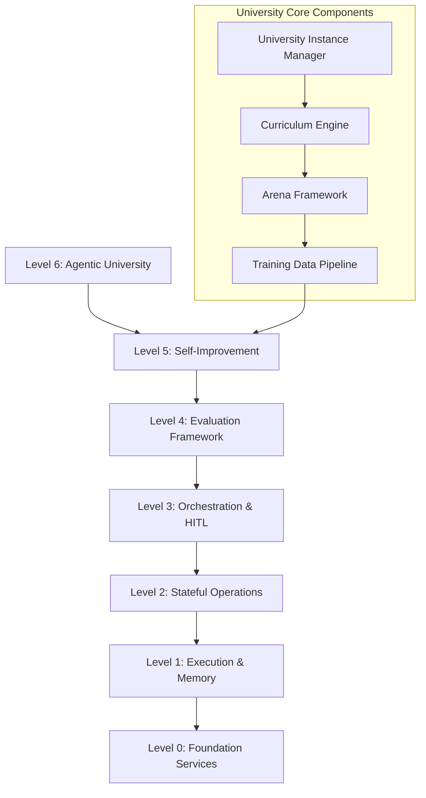

# Agentic University System - Architectural Implementation Plan
## Level 6 Abstraction for DRYAD.AI

**Date**: October 22, 2025  
**Status**: Phase 1 Analysis Complete - Ready for Implementation  
**Target**: Integration with existing DRYAD Levels 0-5

---

## Executive Summary

The Agentic University System represents a Level 6 abstraction layer that builds upon DRYAD's existing production-ready foundation (Levels 0-5). This system provides structured learning environments, competitive training frameworks, and autonomous improvement mechanisms for AI agents.

### Key Findings from System Analysis

1. **DRYAD Foundation**: Production-ready with comprehensive Levels 0-5 implementation
2. **WebSocket Infrastructure**: Robust real-time communication system already in place
3. **Database Schema**: Well-structured with multi-tenant support via `client_app_id`, `tenant_id`, `organization_id`
4. **Authentication**: Secure OAuth2/JWT system with API key support
5. **Level 5 Integration**: Professor Agent and Lyceum self-improvement system operational

---

## Architecture Overview



---

## Phase 2: Core University Infrastructure

### Database Schema Extensions

#### University Model
```sql
-- University instances with multi-tenant isolation
CREATE TABLE universities (
    id VARCHAR PRIMARY KEY,
    name VARCHAR(255) NOT NULL,
    description TEXT,
    owner_user_id VARCHAR NOT NULL REFERENCES users(id),
    client_app_id VARCHAR REFERENCES client_applications(id),
    tenant_id VARCHAR,
    organization_id VARCHAR REFERENCES organizations(id),
    
    -- Configuration
    settings JSON DEFAULT '{}',
    isolation_level VARCHAR(50) DEFAULT 'strict',
    max_agents INTEGER DEFAULT 100,
    max_concurrent_competitions INTEGER DEFAULT 10,
    
    -- Status
    status VARCHAR(50) DEFAULT 'active',
    created_at TIMESTAMP DEFAULT CURRENT_TIMESTAMP,
    updated_at TIMESTAMP DEFAULT CURRENT_TIMESTAMP
);
```

#### Agent Model
```sql
-- AI agents within university instances
CREATE TABLE university_agents (
    id VARCHAR PRIMARY KEY,
    university_id VARCHAR NOT NULL REFERENCES universities(id),
    name VARCHAR(255) NOT NULL,
    agent_type VARCHAR(100) NOT NULL, -- 'student', 'instructor', 'researcher'
    configuration JSON NOT NULL,
    
    -- Training state
    current_curriculum_level_id VARCHAR REFERENCES curriculum_levels(id),
    competency_score FLOAT DEFAULT 0.0,
    training_data_collected INTEGER DEFAULT 0,
    
    -- Performance metrics
    competition_wins INTEGER DEFAULT 0,
    competition_losses INTEGER DEFAULT 0,
    average_score FLOAT DEFAULT 0.0,
    
    -- Status
    status VARCHAR(50) DEFAULT 'active',
    created_at TIMESTAMP DEFAULT CURRENT_TIMESTAMP,
    updated_at TIMESTAMP DEFAULT CURRENT_TIMESTAMP
);
```

### API Endpoints Design

#### University Management
```python
# app/api/v1/endpoints/universities.py
@router.post("/universities", response_model=UniversityResponse)
async def create_university(
    request: UniversityCreateRequest,
    current_user: User = Depends(get_current_user)
):
    """Create a new university instance"""
    pass

@router.get("/universities/{university_id}", response_model=UniversityResponse)
async def get_university(
    university_id: str,
    current_user: User = Depends(get_current_user)
):
    """Get university details"""
    pass

@router.post("/universities/{university_id}/agents", response_model=AgentResponse)
async def create_agent(
    university_id: str,
    request: AgentCreateRequest,
    current_user: User = Depends(get_current_user)
):
    """Create a new agent within university"""
    pass
```

### Authentication Integration

The university system will leverage DRYAD's existing multi-tenant authentication:

```python
# Enhanced token with university context
def create_university_access_token(user: User, university_id: str) -> str:
    payload = {
        "user_id": user.id,
        "email": user.email,
        "university_id": university_id,
        "university_roles": get_university_roles(user.id, university_id),
        # ... existing claims
    }
    return create_access_token_with_context(payload)
```

---

## Phase 3: Curriculum Engine

### Database Schema
```sql
-- Curriculum paths (e.g., "Novice to Expert", "Specialized Research")
CREATE TABLE curriculum_paths (
    id VARCHAR PRIMARY KEY,
    university_id VARCHAR NOT NULL REFERENCES universities(id),
    name VARCHAR(255) NOT NULL,
    description TEXT,
    difficulty_level VARCHAR(50) DEFAULT 'beginner',
    estimated_duration_hours INTEGER DEFAULT 40,
    prerequisites JSON DEFAULT '[]'
);

-- Individual curriculum levels
CREATE TABLE curriculum_levels (
    id VARCHAR PRIMARY KEY,
    curriculum_path_id VARCHAR NOT NULL REFERENCES curriculum_paths(id),
    level_number INTEGER NOT NULL,
    name VARCHAR(255) NOT NULL,
    description TEXT,
    learning_objectives JSON NOT NULL,
    challenges JSON NOT NULL, -- Array of challenge definitions
    passing_score FLOAT DEFAULT 0.7
);

-- Agent progression tracking
CREATE TABLE agent_progress (
    id VARCHAR PRIMARY KEY,
    agent_id VARCHAR NOT NULL REFERENCES university_agents(id),
    curriculum_level_id VARCHAR NOT NULL REFERENCES curriculum_levels(id),
    current_challenge_index INTEGER DEFAULT 0,
    score FLOAT DEFAULT 0.0,
    status VARCHAR(50) DEFAULT 'in_progress',
    started_at TIMESTAMP DEFAULT CURRENT_TIMESTAMP,
    completed_at TIMESTAMP
);
```

---

## Phase 4: Arena/Dojo Competition Framework

### Integration with Level 4 Evaluation Harness

```python
# app/services/university/arena_engine.py
class ArenaEngine:
    def __init__(self, evaluation_harness: EvaluationHarness):
        self.evaluation_harness = evaluation_harness
        self.connection_manager = connection_manager  # Existing WebSocket
    
    async def start_competition(self, competition_config: CompetitionConfig):
        # Use Level 4 evaluation framework for scoring
        evaluation_request = EvaluationRequest(
            agent_id=competition_config.agent_id,
            benchmark_id=competition_config.benchmark_id,
            config=competition_config.evaluation_config
        )
        
        result = await self.evaluation_harness.run_evaluation(evaluation_request)
        
        # Broadcast real-time updates via WebSocket
        await self.connection_manager.broadcast_to_topic(
            f"university_{competition_config.university_id}_competitions",
            {
                "type": "competition_update",
                "competition_id": competition_config.competition_id,
                "agent_id": competition_config.agent_id,
                "score": result.scores,
                "status": "completed"
            }
        )
```

---

## Phase 5: WebSocket Integration

### Extending Existing Connection Manager

```python
# app/core/websocket_manager.py - Extended for university channels
class UniversityConnectionManager(ConnectionManager):
    async def subscribe_to_university(self, session_id: str, university_id: str):
        """Subscribe to all university-specific channels"""
        topics = [
            f"university_{university_id}_competitions",
            f"university_{university_id}_progress",
            f"university_{university_id}_system"
        ]
        
        for topic in topics:
            await self.subscribe_to_topic(session_id, topic)
    
    async def broadcast_competition_result(self, university_id: str, result: CompetitionResult):
        """Broadcast competition results to university subscribers"""
        await self.broadcast_to_topic(
            f"university_{university_id}_competitions",
            {
                "type": "competition_result",
                "competition_id": result.competition_id,
                "winner_agent_id": result.winner_agent_id,
                "scores": result.scores,
                "leaderboard_update": result.leaderboard
            }
        )
```

---

## Phase 6: Training Data Pipeline

### Integration with Level 5 Lyceum

```python
# app/services/university/training_pipeline.py
class TrainingDataPipeline:
    def __init__(self, professor_agent: ProfessorAgent):
        self.professor_agent = professor_agent
    
    async def collect_competition_data(self, competition_result: CompetitionResult):
        """Collect data from competitions for improvement proposals"""
        # Analyze competition patterns
        analysis = await self.analyze_competition_patterns(competition_result)
        
        # Submit improvement proposal to Level 5 Professor Agent
        proposal = await self.professor_agent.submit_proposal(
            project_id=f"university_improvement_{competition_result.university_id}",
            experiment_id=competition_result.competition_id,
            title=f"Improvement based on competition {competition_result.competition_id}",
            description=analysis["insights"],
            implementation_details=analysis["recommendations"],
            validation_results=analysis["metrics"]
        )
        
        return proposal
```

---

## Technical Integration Points

### 1. Database Integration
- **Multi-tenancy**: Leverage existing `client_app_id`, `tenant_id`, `organization_id` fields
- **Foreign Keys**: Maintain referential integrity with existing user and organization tables
- **Migrations**: Use Alembic for schema evolution

### 2. Authentication & Authorization
- **Existing OAuth2**: Reuse current authentication flow
- **Role Extensions**: Add university-specific roles (`university_admin`, `instructor`, `student`)
- **API Keys**: Support university-level API keys for automation

### 3. Real-time Communication
- **WebSocket Reuse**: Extend existing connection manager
- **Topic Hierarchy**: Implement university-specific topic namespaces
- **Performance**: Maintain <100ms latency for competition updates

### 4. Level Integration
- **Level 4**: Direct integration with Evaluation Harness for scoring
- **Level 5**: Training data pipeline feeds into Professor Agent for self-improvement
- **Backward Compatibility**: Ensure existing functionality remains unchanged

---

## Implementation Priority

### Week 1-2: Core Infrastructure
1. Database schema implementation
2. University Instance Manager API
3. Basic agent creation and management

### Week 3-4: Curriculum Engine
1. Curriculum path definitions
2. Level progression system
3. Challenge validation logic

### Week 5-6: Competition Framework
1. Arena integration with Level 4
2. Real-time WebSocket updates
3. Leaderboard system

### Week 7-8: Advanced Features
1. Training data pipeline
2. Lyceum integration
3. Multi-university orchestration

---

## Security Considerations

1. **Isolation**: Strict university instance isolation using existing multi-tenant architecture
2. **Rate Limiting**: University-specific rate limits to prevent resource abuse
3. **Data Privacy**: Training data anonymization for cross-university learning
4. **Access Control**: Granular permissions for university administration

---

## Performance Targets

- **API Response**: <200ms for university management operations
- **WebSocket Latency**: <100ms for real-time competition updates
- **Competition Execution**: <30s for standard evaluation runs
- **Database Queries**: <50ms for leaderboard and progress queries

---

## Success Metrics

1. **Agent Competency**: Average score improvement of 25% over baseline
2. **Training Efficiency**: 40% reduction in training time through curriculum optimization
3. **System Scalability**: Support for 100+ concurrent university instances
4. **User Engagement**: 80% agent participation in competitive events

This architectural plan provides a comprehensive roadmap for implementing the Agentic University System as a Level 6 abstraction on top of DRYAD's existing robust foundation.